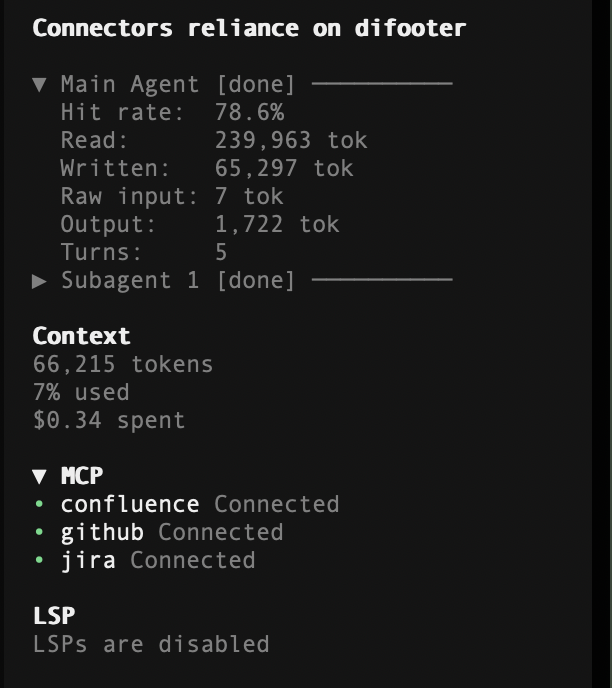
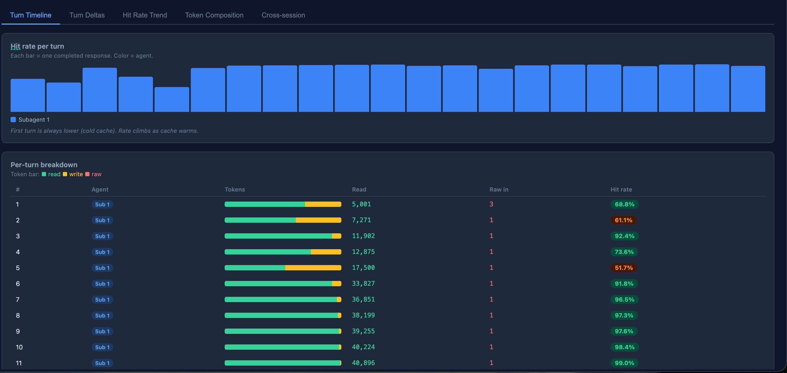
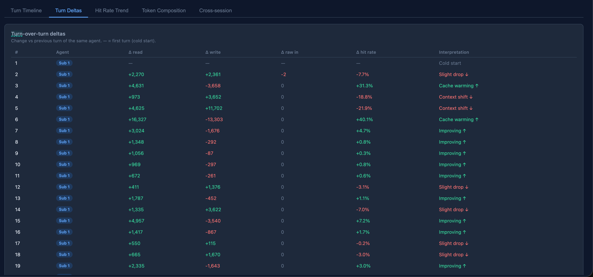
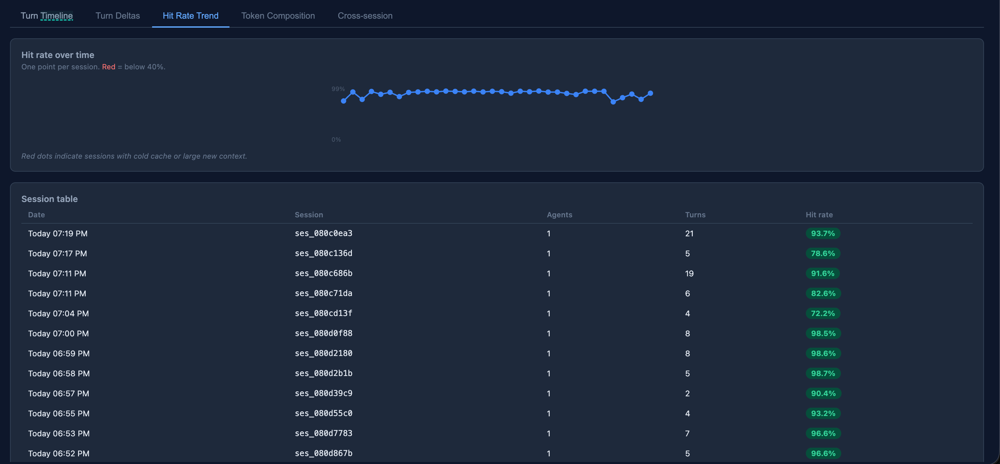
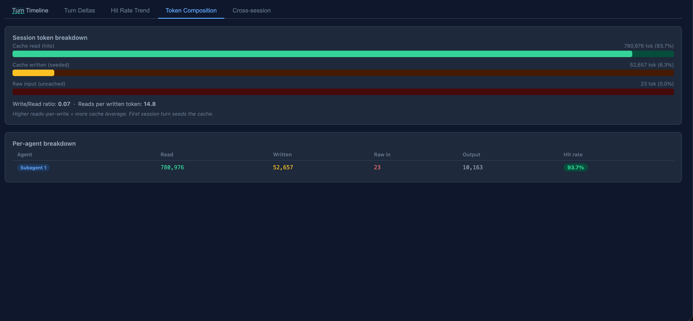
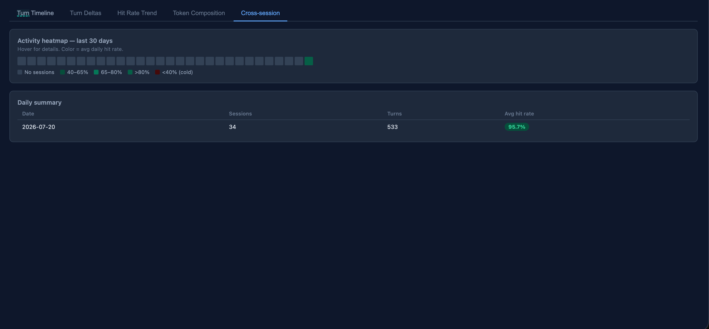

# opencode-cache-stats

An [opencode](https://opencode.ai) plugin that displays a live **cache hit rate** widget
in the TUI sidebar and writes per-turn stats to a JSONL file.

## Install

```bash
npm i opencode-cache-stats
```

Then add to `~/.config/opencode/opencode.json`:

```json
{
  "plugin": ["@alex123bob/opencode-cache-stats"]
}
```

Restart opencode. After the first assistant response, the right-column sidebar shows cache stats for each agent.



## Sidebar behaviour

Active agents show full stats. When an agent finishes (no response for 30 s) its section
collapses to a single header line. Click any header to expand or collapse it manually.

```
▼ Main Agent (active) ────────
  Hit rate:  68.9%
  Read:      1,240 tok
  Turns:         3
▶ Subagent 1 [done] ──────────   ← click to expand
▶ Subagent 2 [done] ──────────
```

## Understanding the metrics

> **All sidebar values are cumulative for the entire session** — they accumulate
> across every turn, not reset per turn. The JSONL file records per-turn values
> so you can analyze individual turns separately.

| Metric | What it means |
|---|---|
| **Hit rate** | `cacheRead / (cacheRead + cacheWrite + inputRaw) × 100` — the fraction of total input tokens served from cache. Higher is cheaper and faster. |
| **Read** | Tokens retrieved from the prompt cache (cache hits). These are not re-processed by the model, so they cost less. |
| **Written** | Tokens written into the prompt cache this session (cache misses that seeded the cache). Only shown when non-zero. Not all providers report this. |
| **Raw input** | Fresh, uncached input tokens — the part of your prompt that was processed from scratch. |
| **Output** | Completion tokens generated by the model. |
| **Turns** | Number of completed assistant responses in this session. |

## Stats file

Each completed turn appends one JSON line to:

```
~/.config/opencode/cache-stats.jsonl
```

Example record:

```json
{"ts":"2026-07-20T10:23:01.000Z","sessionID":"ses_abc123","providerID":"anthropic","modelID":"claude-sonnet-4-6","turn":3,"cacheRead":1240,"cacheWrite":512,"inputRaw":308,"output":320,"totalInput":2060,"hitRate":60.2,"parentID":null,"agentLabel":"Main Agent"}
```

> **Note:** The `hitRate` field in the JSONL file is **per-turn** (computed from
> that turn's tokens only). The sidebar hit rate is session-cumulative. Both use
> the same formula: `cacheRead / (cacheRead + cacheWrite + inputRaw) × 100`.

## Live dashboard

Start a live web dashboard to explore your cache stats.

Add this shell function to your `~/.zshrc` or `~/.bash_profile`:

```bash
oc-dash() { node ~/.cache/opencode/packages/@alex123bob/opencode-cache-stats@latest/node_modules/@alex123bob/opencode-cache-stats/bin/dashboard.js "$@"; }
```

Then run:

```bash
oc-dash
```

The `@latest` path always resolves to the currently installed version, so the function keeps working after upgrades.

Opens `http://localhost:4321` in your browser automatically. The dashboard:

- **Live updates** as new turns are appended to the JSONL file
- **5 views:** Turn Timeline, Turn Deltas, Hit Rate Trend, Token Composition, Cross-session Heatmap
- **Per-turn deltas** — see how cache read/write/raw changed turn-over-turn and whether the cache is warming up
- **Filters** — narrow by time range (today / 7d / 30d) and agent type (main / subagents)

### Turn Timeline

Hit rate per turn as a bar chart, plus a per-turn token composition table (green = cache read, yellow = cache write, red = raw input).



### Turn Deltas

How each metric changed turn-over-turn for the same agent — instantly shows whether the cache is warming up or context shifted.



### Hit Rate Trend

Hit rate across sessions over time, with a session table. Red dots mark sessions with cold cache.



### Token Composition

Session-level breakdown of cache read vs written vs raw input, plus write/read ratio and per-agent table.



### Cross-session Heatmap

30-day activity heatmap (colour = avg daily hit rate) and daily summary table.



### Options

| Flag | Default | Description |
|---|---|---|
| `--port` | `4321` | Preferred port (auto-increments if in use) |
| `--file` | `~/.config/opencode/cache-stats.jsonl` | Path to JSONL |
| `--no-open` | — | Don't auto-open browser |

Stop with **Ctrl+C**.

## Cache hit rate definition

```
hitRate = cacheRead / (cacheRead + cacheWrite + inputRaw) × 100
```

This is the fraction of total input tokens served from cache rather than processed fresh.

## Provider compatibility

| Provider | cache read | cache write |
|---|---|---|
| Anthropic | Yes | Yes |
| OpenAI | Yes | Conditional |
| Google Vertex / Gemini | Yes | No |
| Amazon Bedrock | Yes | Yes |
| Groq | Yes | No |
| xAI (Grok) | Yes | No |
| Mistral | Yes | No |
| Cohere | No | No |

When cache data is unavailable the sidebar shows `No cache data` instead of a misleading 0%.

## License

MIT
